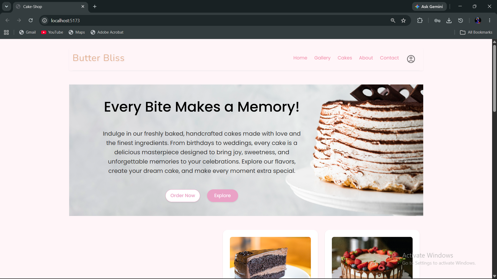
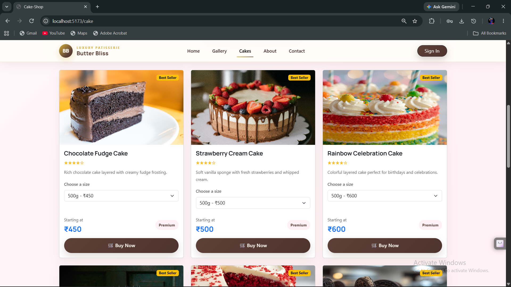
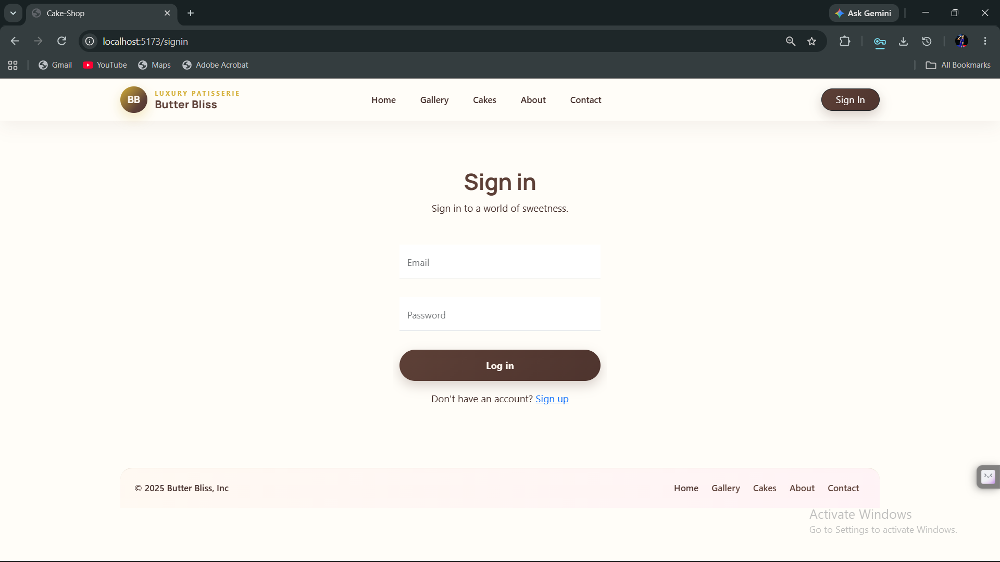
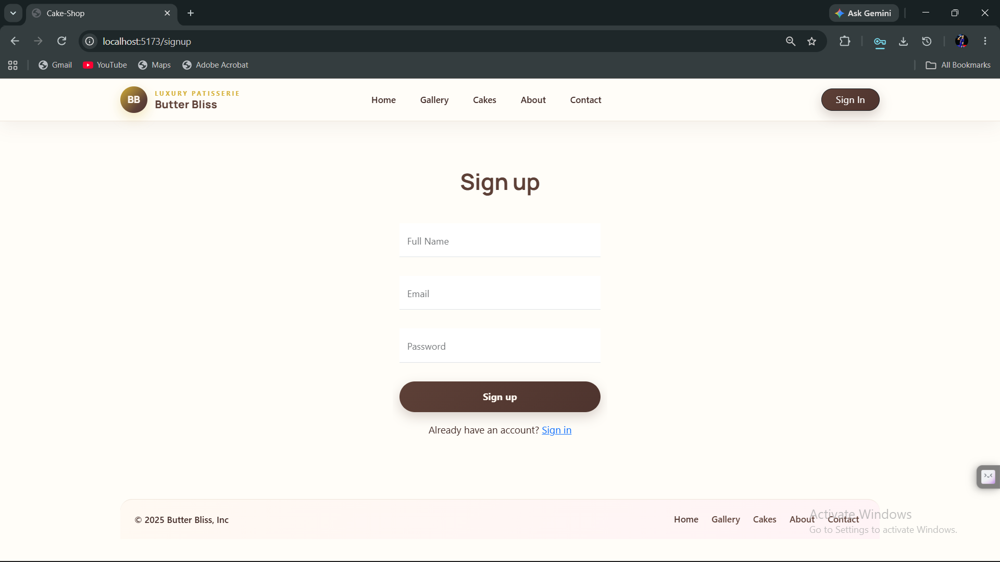

# 🎂 Butter Bliss — Cake Shop E-Commerce Web Application

A full-stack e-commerce web application for a cake shop called **Butter Bliss**, built with the MERN stack. Users can browse handcrafted cakes, view product details with pricing variants, and securely sign in to place orders.

## 🔗 Live Demo

| Layer | Link |
|-------|------|
| 🌐 Frontend | [cakeshop-by-mohan.netlify.app](https://cakeshop-by-mohan.netlify.app) |
| ⚙️ Backend API | [cakeshop-website-backend.onrender.com](https://cakeshop-website-backend.onrender.com) |

---

## 📸 Screenshots

### 🏠 Home Page


### 🛍️ Product Highlights


### 🍫 Chef's Signature Cake


### 🔐 Sign In Page


### 📝 Sign Up Page


---

## ✨ Features

- 🏠 Landing page with hero banner and featured cake sections
- 🎂 Premium cake collection with **Best Seller** badges and weight/price variants
- 🍫 Chef's Signature product detail page with discount pricing
- 🛒 Add to cart and order management
- 🔐 JWT-based authentication — Sign In / Sign Up
- 🔒 Protected routes — only logged-in users can place orders
- 📡 12+ RESTful API endpoints for products, cart, and orders
- 📱 Fully responsive design across all devices

---

## 🛠️ Tech Stack

| Layer     | Technology                                      |
|-----------|-------------------------------------------------|
| Frontend  | React.js, TypeScript, Vite, Bootstrap, CSS3     |
| Backend   | Node.js, Express.js                             |
| Database  | MongoDB, Mongoose                               |
| Auth      | JWT (JSON Web Tokens), bcrypt                   |
| Dev Tools | Postman, ESLint, Git, VS Code                   |
| Deployed  | Netlify (frontend), Render (backend)            |

---

## 📁 Project Structure

```
cakeshop-website/
├── backend/
│   ├── config/             # DB connection and app config
│   ├── controllers/        # Route handler logic
│   ├── middleware/         # JWT auth middleware
│   ├── models/             # Mongoose schemas (User, Product, Cart, Order)
│   ├── routes/             # Express API routes
│   ├── scripts/            # Utility / seed scripts
│   ├── .env.example        # Environment variable template
│   └── server.js           # Entry point
│
├── frontend/
│   ├── public/             # Static assets
│   ├── src/                # React components, pages, hooks
│   ├── index.html          # HTML entry point
│   ├── tsconfig.json       # TypeScript config
│   └── vercel.json         # Deployment config
│
└── screenshots/
    ├── screenshot-home.png
    ├── screenshot-products.png
    ├── screenshot-Chef's Signature Cake.png
    ├── screenshot-signin.png
    └── screenshot-signup.png
```

---

## 🚀 Run Locally

### Prerequisites
- Node.js v18+
- MongoDB (local or MongoDB Atlas)

### 1. Clone the repository
```bash
git clone https://github.com/MohanRaj2804/cakeshop-website.git
cd cakeshop-website
```

### 2. Setup Backend
```bash
cd backend
npm install
```

Copy `.env.example` to `.env` and fill in your values:
```env
PORT=5000
MONGO_URI=your_mongodb_connection_string
JWT_SECRET=your_jwt_secret_key
```

```bash
npm start
```

### 3. Setup Frontend
```bash
cd ../frontend
npm install
```

Copy `.env.example` to `.env` and fill in:
```env
VITE_API_URL=http://localhost:5000
```

```bash
npm run dev
```

App runs at `http://localhost:5173`

---

## 🔌 API Endpoints

| Method | Endpoint              | Description             | Auth Required |
|--------|-----------------------|-------------------------|---------------|
| POST   | /api/auth/register    | Register a new user     | ❌            |
| POST   | /api/auth/login       | Login and get JWT token | ❌            |
| GET    | /api/products         | Get all products        | ❌            |
| GET    | /api/products/:id     | Get single product      | ❌            |
| POST   | /api/cart             | Add item to cart        | ✅            |
| GET    | /api/cart             | Get user's cart         | ✅            |
| PUT    | /api/cart/:id         | Update cart item        | ✅            |
| DELETE | /api/cart/:id         | Remove cart item        | ✅            |
| POST   | /api/orders           | Place a new order       | ✅            |
| GET    | /api/orders           | Get user's orders       | ✅            |
| GET    | /api/orders/:id       | Get single order        | ✅            |
| DELETE | /api/orders/:id       | Cancel an order         | ✅            |

---

## 🌱 Future Improvements

- [ ] Admin dashboard for managing products and orders
- [ ] Payment gateway integration (Razorpay)
- [ ] Product search and filter by category
- [ ] Email confirmation on order placement
- [ ] Customer reviews and ratings

---

## 👨‍💻 Author

**Mohan Raj V**
- 🐙 GitHub: [@MohanRaj2804](https://github.com/MohanRaj2804)
- 💼 LinkedIn: [linkedin.com/in/mohan-rajv](https://linkedin.com/in/mohan-rajv)
- 📧 Email: mohanraj171810@gmail.com